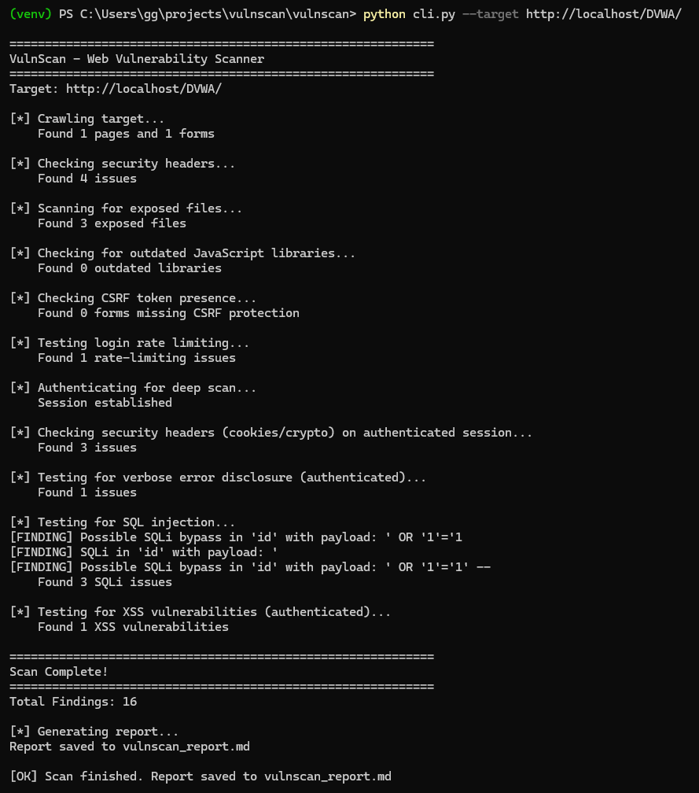
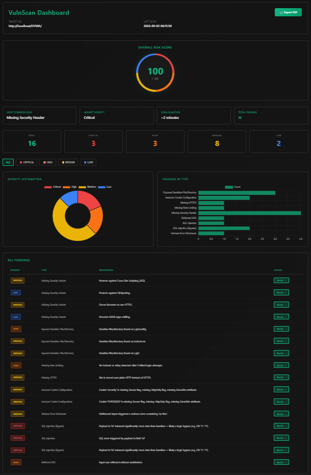
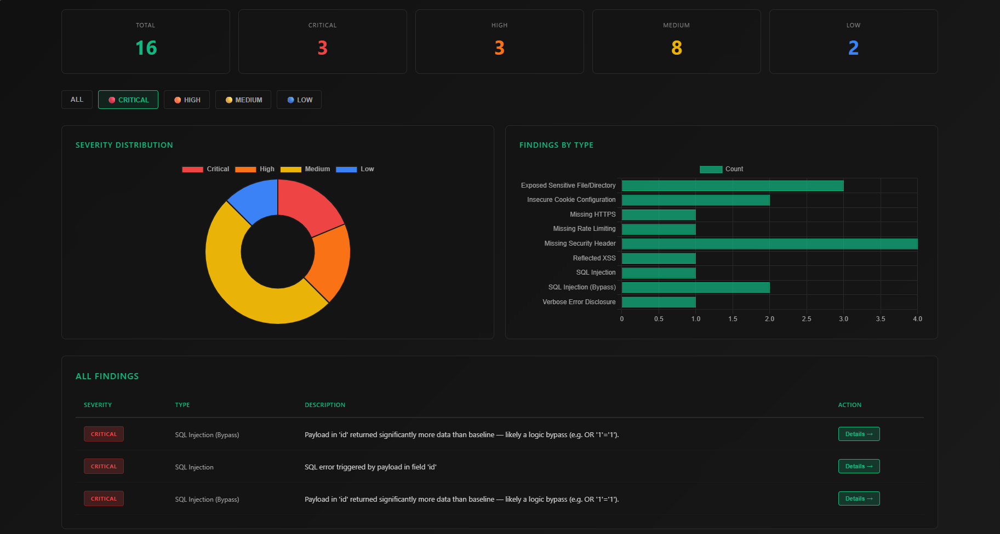
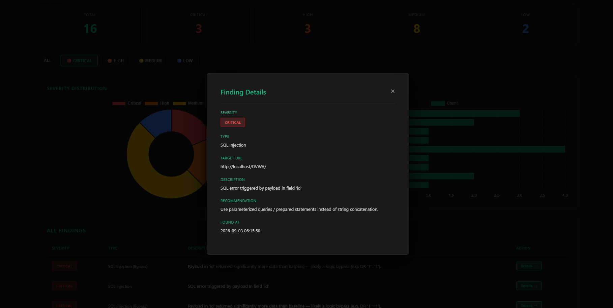
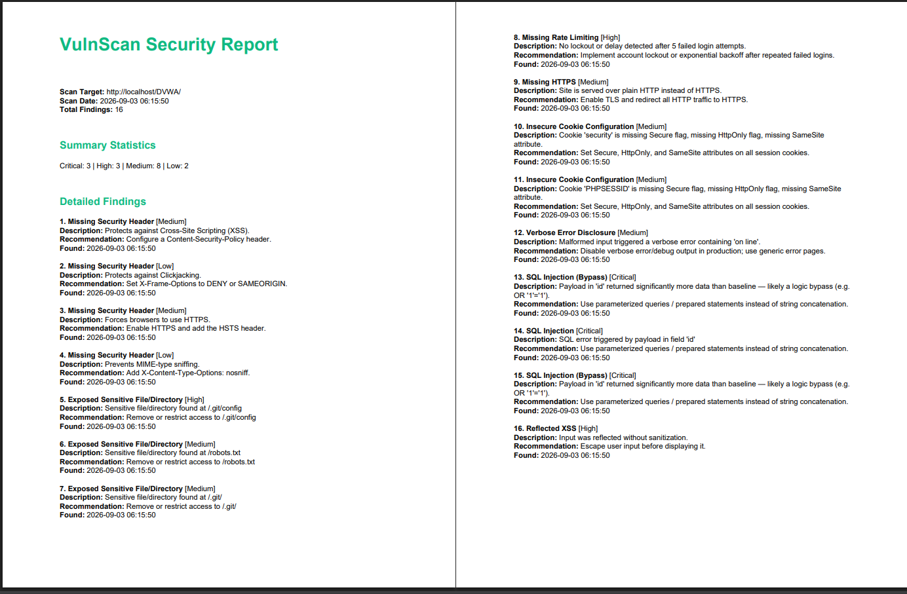

# VulnScan — Web Vulnerability Scanner

A Python-based web vulnerability scanner with authenticated scanning support — detects security issues, classifies severity, and generates reports. Built as an educational/portfolio project covering 6 of 10 OWASP Top 10:2025 categories.

<p>
<a href="#problem-statement"></a>
<a href="#features"></a>
<a href="#architecture"></a>
<a href="#setup--installation"></a>
</p>
<p>
<a href="#usage"></a>
<a href="#dashboard-features"></a>
<a href="#example-scan-results"></a>
<a href="#screenshots"></a>
</p>
<p>
<a href="#owasp-top-10-coverage"></a>
<a href="#tech-stack"></a>
<a href="#limitations"></a>
<a href="#future-enhancements"></a>
</p>

---

## Problem Statement

- Professional vulnerability scanners (Nessus, Burp Suite Pro) are expensive and overkill for learning/small-scale use
- VulnScan is a lightweight, open-source alternative built to understand OWASP Top 10 detection mechanics — including authenticated attack surfaces, not just public pages
- Provides automated detection, severity classification, and remediation guidance in a single pipeline

---

## Features

**Core Scanning Modules**
- Web crawler — BFS-based, discovers pages and forms within scope
- Security headers checker — flags missing CSP, HSTS, X-Frame-Options, X-Content-Type-Options
- Exposed files scanner — checks for publicly accessible sensitive paths (`.git`, `.env`, `/admin`)
- Outdated JS library detector — flags known-vulnerable JS library versions
- SQL injection prober — error-based and boolean-based detection, runs against authenticated pages
- Reflected XSS detector — tests authenticated form fields for unsanitized reflection
- Cryptographic/cookie checker — HTTPS enforcement, missing `Secure`/`HttpOnly`/`SameSite` cookie flags
- Verbose error disclosure checker — sends malformed input, detects leaked stack traces/SQL errors
- Authentication checker — missing login rate limiting, missing CSRF tokens on state-changing forms

**Authenticated Scanning**
- Automatically logs into DVWA and scans real vulnerable pages (not just the public login page)
- Session-aware: SQLi, XSS, error disclosure, and cookie checks all run against the authenticated attack surface

**Storage & Reporting**
- SQLite database — persistent findings, queryable by severity/type
- Markdown report generator
- PDF export

**Web Dashboard**
- Risk score gauge (0–100, weighted by severity)
- Severity distribution chart (donut) + findings-by-type chart (bar)
- Filterable, sortable findings table
- Click-through detail modals
- Dark mode UI

---

## Architecture

```
Crawler (discovers pages/forms)
   → Unauthenticated checks (headers, files, JS, CSRF, rate limiting)
   → Authenticated session (auto-login)
   → Authenticated checks (SQLi, XSS, error disclosure, cookies)
   → SQLite database
   → CLI report + Flask dashboard
```

---

## Setup & Installation

**Prerequisites:** Python 3.10+, 8GB RAM minimum

```bash
# 1. Clone
git clone https://github.com/rudransh-v/web_vulnscan_project.git
cd web_vulnscan_project/vulnscan

# 2. Virtual environment
python -m venv venv
venv\Scripts\Activate.ps1

# 3. Install dependencies
pip install requests beautifulsoup4 flask reportlab

# 4. Set up target (DVWA via XAMPP)
# - Install XAMPP, start Apache + MySQL
# - Clone DVWA into C:\xampp\htdocs\DVWA
# - Set security level to Low at http://localhost/DVWA/security.php
```

---

## Usage

```bash
# Run full scan (unauthenticated + authenticated checks)
python cli.py --target http://localhost/DVWA/

# View report
cat vulnscan_report.md

# Launch dashboard
python dashboard/app.py
# → open http://localhost:5000
```

---

## Dashboard Features

- Risk score gauge + quick stats (most common issue, highest severity, total findings)
- Interactive severity/type charts
- Click severity cards or filter buttons to narrow the findings table
- "Details" button opens a modal with full finding info
- PDF export button

---

## Example Scan Results

Against DVWA (Low security), full pipeline including authenticated checks:

| Check | Findings |
|---|---|
| Missing security headers | 4 |
| Exposed files | 3 |
| Outdated JS libraries | 0 |
| Missing CSRF protection | 0 |
| Missing rate limiting | 1 |
| Insecure cookie config | 2 |
| Verbose error disclosure | 1 |
| SQL injection | 3 |
| Reflected XSS | 1 |

**Total:** 16 findings — 3 Critical, 3 High, 8 Medium, 2 Low

---

## Screenshots







---

## OWASP Top 10 Coverage

Mapped to OWASP Top 10:2025.

| Category | Status | Detection |
|---|---|---|
| A01 – Broken Access Control | ❌ Not covered | Needs app-specific IDOR logic, out of scope for black-box scanning |
| A02 – Security Misconfiguration | ✅ Covered | Missing headers, exposed files/dirs |
| A03 – Software Supply Chain Failures | ⚠️ Partial | Outdated JS libraries (small hardcoded list) |
| A04 – Cryptographic Failures | ✅ Covered | HTTPS enforcement, cookie security flags |
| A05 – Injection | ✅ Covered | SQL injection, reflected XSS |
| A06 – Insecure Design | ❌ Not covered | Not black-box-detectable |
| A07 – Authentication Failures | ✅ Covered | Missing rate limiting, missing CSRF tokens |
| A08 – Software/Data Integrity Failures | ❌ Not covered | Needs code/build access |
| A09 – Security Logging & Alerting Failures | ❌ Not covered | Needs infra access |
| A10 – Mishandling of Exceptional Conditions | ✅ Covered | Verbose error/stack trace disclosure |

**6 of 10 categories covered with genuine automated detection.** A01/A06/A08/A09 are deliberately excluded — they require code review or infrastructure access no black-box scanner (including commercial ones) fully automates either.

---

## What This Demonstrates

- **Security knowledge** — OWASP Top 10 vulnerability types, severity classification, remediation guidance, authenticated attack surface testing
- **Software engineering** — full-stack build (Python backend + Flask/JS frontend), modular scanner architecture, SQLite schema design
- **DevOps** — Git/GitHub workflow, virtual environments, dependency management
- **Practical skills** — session/cookie handling, CSRF token scraping, debugging real environment issues, rate-limiting/timeout handling

---

## Tech Stack

| Layer | Tools |
|---|---|
| Backend | Python 3.14 |
| Web server | Flask |
| Database | SQLite |
| Frontend | HTML / CSS / JS |
| Charts | Chart.js |
| Reports | ReportLab |
| Libraries | requests, BeautifulSoup4 |

---

## Key Learnings

- HTTP response analysis for vulnerability detection
- Web crawling scope control (BFS, depth limits, timeouts)
- Session/cookie handling, CSRF token scraping for authenticated scanning
- SQLite schema design + querying
- Flask routing, Jinja2 templating, Chart.js integration

---

## Limitations

- No support for JavaScript-rendered SPAs (requests + BeautifulSoup only see static HTML)
- Outdated JS library list is small and manually maintained (5 libraries, no live CVE feed)
- Risk score is a simple weighted sum, not CVSS-based (currently caps at 100/100 on heavily vulnerable targets like DVWA)
- No authentication on the dashboard itself — local/demo use only
- Authenticated scanning is DVWA-specific (`dvwa_auth.py` hardcodes DVWA's login flow) — not generalized to arbitrary targets

---

## Future Enhancements

**Phase 2:** Stored XSS detection, TLS/SSL certificate checks, CVE database integration, scan scheduling, notifications

**Phase 3:** Generalized authentication (beyond DVWA), PostgreSQL backend, multi-target scanning, dashboard auth, compliance reporting (OWASP/PCI-DSS), API-driven architecture

---

## Author

**Rudransh Vyas** — 3rd Year ECE Student, Cybersecurity Focus
GitHub: [github.com/rudransh-v](https://github.com/rudransh-v)
