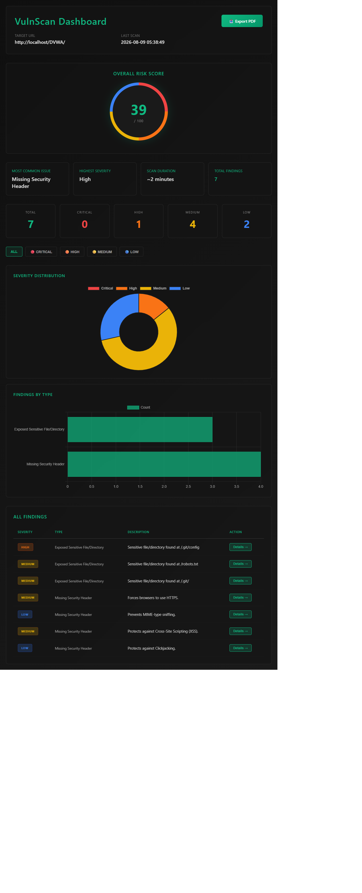
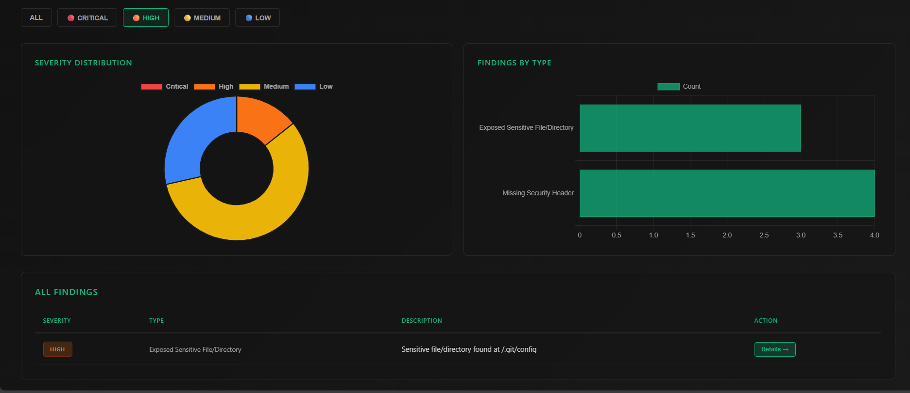
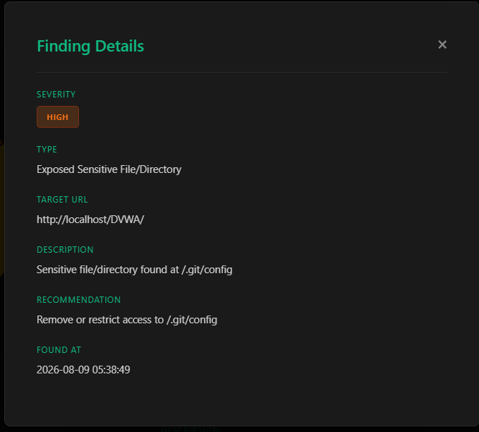
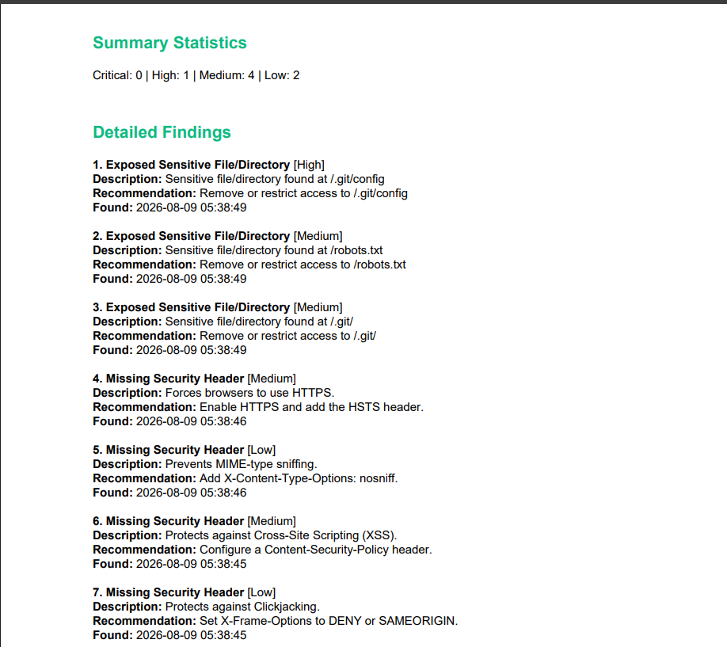

# VulnScan - Lightweight Web Vulnerability Scanner

Enterprise SIEM tools like Splunk and Nessus cost thousands per year. VulnScan is a lightweight, open-source web vulnerability scanner that detects security issues in real time, classifies severity, and generates professional reports — the core SOC workflow, built from scratch in Python.

## Problem Statement

Web vulnerability scanning is critical but expensive. Professional tools are overkill for small businesses and startups. VulnScan addresses this gap by providing automated vulnerability detection targeting OWASP Top 10 categories, professional reporting with severity classification and remediation guidance, and a web-based dashboard for visualization.

## Features

Core Scanning Modules

Web Crawler - Discovers pages and forms via BFS, respects scope boundaries
Security Headers Checker - Detects missing CSP, HSTS, X-Frame-Options, X-Content-Type-Options
Exposed Files Scanner - Identifies publicly accessible sensitive paths (/.git, /.env, /admin)
Outdated JS Library Detector - Flags known-vulnerable JavaScript library versions
SQL Injection Prober - Tests form fields with SQLi payloads (error-based, boolean-based)
XSS Vulnerability Detector - Submits test payloads, detects reflected XSS

Storage and Reporting

SQLite Database - Persistent findings storage, queryable by severity and type
CLI Report Generator - Generates professional Markdown reports
PDF Export - Download findings as formatted PDF

Web Dashboard

Risk Score Gauge - Visual 0-100 risk assessment
Real-time Charts - Severity distribution (donut), findings by type (bar)
Interactive Findings Table - Sortable, filterable by severity
Detail Modals - Click any finding to see full description and recommendations
Dark Mode UI - Professional, polished aesthetic
Quick Stats - Most common issue, highest severity, scan duration

## Architecture

Detection Engine (checks/ folder) discovers pages and forms, then runs security checks. Findings are stored in SQLite database. CLI orchestrator ties everything together, and Flask web server powers the dashboard.

## Setup and Installation

Prerequisites: Python 3.10+, Node.js 18+ (optional), 8GB RAM minimum

Step 1 - Clone Repository

git clone https://github.com/rudransh-v/web_vulnscan_project.git
cd web_vulnscan_project/vulnscan

Step 2 - Create Virtual Environment

python -m venv venv
venv\Scripts\Activate.ps1

Step 3 - Install Dependencies

pip install requests beautifulsoup4 flask reportlab

Step 4 - Set Up Target (DVWA)

Install XAMPP from apachefriends.org. Start Apache and MySQL. Clone DVWA into C:\xampp\htdocs\DVWA. Set security level to Low at http://localhost/DVWA/security.php

## Usage

Run Full Scanner Pipeline

python cli.py --target http://localhost/DVWA/

This will crawl the target, run all security checks, store findings in SQLite, and generate vulnscan_report.md

View CLI Report

cat vulnscan_report.md

Launch Web Dashboard

python dashboard/app.py

Then open browser to http://localhost:5000

## Dashboard Features

Summary Metrics - Risk score gauge, quick stats, severity cards
Interactive Charts - Severity distribution (donut chart), findings by type (bar chart)
Findings Table - Sortable columns, filter by severity, click for details
Filter by Severity - Click severity cards or filter buttons to narrow results
Detail Modal - Click Details button to see full finding information
PDF Export - Download findings as formatted PDF report

## Example Scan Results

When run against DVWA (Low security level), VulnScan typically detects:

Missing Security Headers (4) - CSP, HSTS, X-Frame-Options, X-Content-Type-Options
Exposed Files (3) - /.git/config, /robots.txt, /.git/
Outdated JS Libraries (0-2) - Old jQuery/Bootstrap versions
SQL Injection (0-1) - Login form vulnerable to SQLi
XSS Vulnerabilities (0-1) - Form fields reflect unescaped input

Total findings: 7-11 depending on DVWA configuration

## Evidence Screenshots

#### Dashboard Overview

Complete dashboard view showing risk score gauge, charts, and findings table.

#### Dashboard Filtered Results

Interactive filtering by severity level.

#### Finding Details Modal

Click any finding to see full details.

##### PDF Export

Professional PDF report generation.

## What This Project Demonstrates

Security Knowledge - Web application vulnerability types (OWASP Top 10), attack signatures and payloads, risk assessment and severity classification, incident response workflow

Software Engineering - Full-stack application development (backend + frontend), modular architecture with reusable scanner modules, database design and querying (SQLite), RESTful API design (Flask endpoints), web UI/UX (professional dark-mode dashboard)

DevOps and Deployment - Version control (Git/GitHub), Python virtual environments, dependency management (pip), documentation and README best practices

Real-World Skills - Working with third-party libraries (requests, BeautifulSoup, Flask), debugging and troubleshooting, testing and validation, performance optimization (rate-limiting, timeouts)

## Technology Stack

Backend - Python 3.14
Web Server - Flask
Database - SQLite
Frontend - HTML/CSS/JavaScript
Charts - Chart.js
Reports - ReportLab
Libraries - requests, BeautifulSoup4

## Project Timeline

Days 1-2 - Core crawler + headers checker (Complete)
Days 3-4 - Exposed files + outdated JS (Complete)
Days 5-6 - SQLi + XSS probers (Complete)
Day 7 - Database + CLI pipeline (Complete)
Day 8 - Web dashboard + charts (Complete)
Day 9 - End-to-end testing + evidence (Complete)
Day 10 - Documentation + final push (Complete)

## Key Learnings

Technical Insights - HTTP response analysis for vulnerability detection, web crawling complexity (BFS, scope control, timeout handling), security best practices (input validation, output encoding, CSRF token handling), database design and querying, web UI frameworks (Flask routing, Jinja2 templating, Chart.js integration)

Soft Skills - Project planning and 10-day sprint structure, documentation writing (README, commit messages, code comments), user-centered design for dashboard usability, problem-solving for environment issues (PATH, file locks, imports)

Security Lessons - Defense-in-depth with multiple security layers, severity scoring for risk prioritization, automation for scaling pentesting

## Future Enhancements

Phase 2 - Authenticated scanning, stored XSS detection, TLS/SSL certificate validation, CVE database integration, scan scheduling, email/Slack notifications

Phase 3 - PostgreSQL backend, Kubernetes deployment, multi-target scanning, user authentication, compliance reporting (OWASP, PCI-DSS), API-driven architecture

## License

MIT License - Free for educational and personal use.

## Author

Rudransh V - 3rd Year Computer Science Student, Cybersecurity Focus

GitHub: https://github.com/rudransh-v
